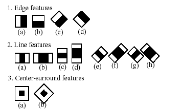

# OpenCV Feature Detection using Haar Cascade

In this short coding exercise I have used a basic feature of OpenCV that is mainly used for face detection but I applied it to something so simple as an orange just to see how the feature detection (if there are any in an orange besides an edge against a background) was doing. 

The method I used is the so-called haar cascade together with a Cascade Classifier (XML file) that I put together myself with a set of images (negative&positives) using [Cascade Trainer GUI.](https://amin-ahmadi.com/cascade-trainer-gui)

These are - in a nutshell - the main steps I took to put this small experiment together:

+ **Install Cascade Trainer GUI**
+ **Prepare 150 positive images & 300 negative images (Negative to Positive ratio 2:1)**
+ **Apply settings to Cascade Trainer** (see table below for details)
+ **Adjust scaleFactor()**
+ **Size Thresholding via minSize() and maxSize()**
+ **Set minNeighbors()**
+ **Overall checks**


## Contents :
Feature Detection is quite a tricky and challenging task, specially when you are using a cascade classifier that is meant to be used for face detection and yet you use it on such a simple object as an orange.
Bear in mind that the haar cascade classifier is trying to detect features by means of swiping a 'blueprint' (see image below) that fits within its binary structure. Meaning, that all the pixels that fall in the white side of the blueprint together with the black pixels on the other side.
<p align="center" width="100%">
     
</p>

Below a summary of the main functions used with the haar cascade classifier:

| Function            |Action                                                                        |
|:--------------------|------------------------------------------------------------------------------|
|**cv2.CascadeClassifier()**|Import Cascade Classifier XML file|
|**cv2.VideoCapture()**   |Improve Detection via history & varThreshold.|
|**cv2.cvtColor()**|Draw rectangle based on contour.|
|**orange_classifier.detectMultiScale()**    | Initializes detection settings|
|**cv2.rectangle()**    | Add rectangle to detected feature.|
|**cv2.putText()**    | Add text with 'Orange' tag|

## Test Image used: 
### Negative images.


### Positive images:


## Issues:
Although several issues can be spotted right away once we run the program, the fact that the overall detection can be fine-tuned via several parameters such as ```minNeighbors()``` improves the overall experience with the cascade classifier. Actually, it is not detecting any object nor a colour, indeed it is just trying to find features based on the blueprints we mentioned before, so it is basically a feature detection method that plays with the contrast and brightness. Therefore, the positive images were taken with different backgrounds so we can create a cascade classifier with enough contrast and brightness variety. Indeed, the shades generated during the video recording had a huge effect on the results of the feature detection, that's why I decided to play with the background colours and textures, so we can have as much shades of contrast as possible.

Most of the issues are related with:

+ Improper illumination.
+ Shades.
+ Color post-processing. I should have used ```cv2.COLOR_BGR2GRAY()``` instead of ```cv2.COLOR_BGR2LAB()```, but the latter was hard to fine-tune.
+ Haar Cascade Classifier settings (Need to study a bit more what each setting does!).


## Summary:

```python
# Load Cascade Classifier
cv2.CascadeClassifier()
```
```python
# Initialize video capture
cv2.VideoCapture()
```
```python
# Color space conversion (Should be cv2.COLOR_BGR2GRAY)
cv2.cvtColor(frame, cv2.COLOR_BGR2LAB)
```
```python
#Feature detector initialization and settings
orange_classifier.detectMultiScale()
```
```python
#Special feature for Haar Cascade that scales the (target) image/pixel
cv2.CASCADE_SCALE_IMAGE()
```
